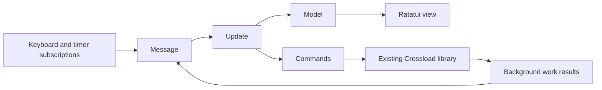

# Crossload TUI architecture

Research date: 2026-09-13. Status: implemented and verified on Linux; macOS execution pending.

## Recommendation

Use **Tears with Ratatui**. The integration proof passed and the existing TUI
has been migrated. Tears most directly
matches the requested Elm approach: explicit state, messages, update, view,
commands and subscriptions. The original fit assessment below is followed by the implementation record.

Keep Kobo import, ADEPT, image preparation, copying and CrossPoint transfer in
the existing library. The framework should own terminal interaction and message
dispatch, not ebook processing or the transfer protocol.

## Options reviewed

| Option | What it provides | Fit for Crossload |
| --- | --- | --- |
| Tears | Elm-style Application, commands and subscriptions over Ratatui; Tokio runtime | Preferred: explicit effects suit loading, import and future sync progress. Requires a blocking-work adapter and runtime integration. |
| tui-realm | Ratatui components, focus/event management, properties/state and update messages | Good alternative if reusable interactive components become the main need. Its React/Elm hybrid is more component-oriented than the requested central model. |
| ratatui-elm | App, Updater, Viewer and runtime tasks; built-in terminal event subscription | Plausible alternative. It takes ownership of event subscription, so our current input loop must be removed, not run alongside it. |
| Ratatui plus a small custom Elm loop | Rendering plus an application-owned model/update/effect runner | Fallback if integration proves unsuitable; we would own lifecycle and effect dispatch ourselves. |

Sources: [Tears published API](https://docs.rs/tears/latest/tears/),
[Tears repository](https://github.com/akiomik/tears),
[tui-realm API](https://docs.rs/tuirealm/latest/tuirealm/),
[ratatui-elm API](https://docs.rs/ratatui-elm/latest/ratatui_elm/),
[Ratatui's Elm architecture guide](https://ratatui.rs/concepts/application-patterns/the-elm-architecture/).

The documentation reviewed identifies Tears 0.8.0 with Ratatui 0.30, Crossterm
0.29 and Tokio 1 dependencies. Crossload already uses Crossterm 0.29, but does
not yet depend on Ratatui or Tokio. Resolve and pin the actual released versions
in Cargo.lock during the proof; check their minimum Rust versions and feature
sets. Do not assume features shown in the repository's main-branch README are
available in that release. Disable optional HTTP/WebSocket integrations: our
existing transport already implements the reader's protocol.

## What changes in our code

Before migration, `src/tui.rs` put search and selection in Model, but kept the active tab,
status, busy state and worker lifetime separately inside run(). Loading a local
or Kobo list is synchronous. Keyboard handling also starts work directly. This
makes future inventory refresh and sync state harder to test independently.

The proposed boundaries are:

- **Model:** active source, list entries, filter, stable selected book identity,
  loading/error state, operation ID, progress, last result and quit intent.
  Future reader inventory belongs here as a snapshot, with unknown, present,
  absent and checking states. An offline reader is unknown, not an empty library.
- **Messages:** selection/search changes, source switch, refresh, start operation,
  list loaded, progress, operation finished, resize and quit requested.
- **Update:** only changes state and describes effects. No filesystem, database,
  network, activation or terminal calls. Rust can mutate an exclusively borrowed
  Model here without cloning every list; the important property is deterministic
  transitions with no external work.
- **View:** reads application state and renders it. Layout-only widget state may
  be separate; rendering must not import, transfer, or change operation state.
- **Effects:** adapt list loading and existing backend operations into commands.
  Run blocking/native work on a dedicated worker or Tokio blocking pool, never on
  the UI executor. Return typed results and send progress back as messages.

List requests and jobs carry IDs. Late results from an old source or completed
job must not replace newer state. Capture the source, book identity and destination
when starting a job, so subsequent navigation cannot redirect the operation.

Keep one mutating book operation active initially. Browsing can remain responsive,
but a second Enter must not start duplicate fulfillment or transfer. Quit while
busy should become a pending quit that waits for a safe completion; aborting an
async wrapper is not cancellation of a blocking native operation. Preserve the
existing uncertain-fulfillment recovery and no-automatic-retry behavior.

## Migration sequence and acceptance checks

1. Build an isolated Tears/Ratatui proof with a list, search, a fake delayed
   operation, progress, failure and quit. Verify terminal restoration on normal
   exit, error and panic. Exercise both small and resized terminals.
2. Check Linux compilation with our pinned Rust toolchain, dependency/license
   changes and binary size. Run native macOS CI before claiming Mac support.
3. Extract model/messages/update and the backend adapter from the current TUI.
   Prove selection after filtering, preview blocking, duplicate-start prevention,
   stale-result rejection and pending quit with deterministic transition tests.
4. Replace the terminal renderer/event loop, retaining commands, defaults and
   backend behavior. Add rendering tests and a PTY import/copy smoke test. Only
   then remove the old loop.
5. Continue with shared reader inventory and sync, then the richer TUI layout.

The proof must demonstrate progress from blocking work and safe worker shutdown.
If it cannot do so cleanly, retain the same model/message/effect boundaries and
use Ratatui with a small application-owned event loop. No backend rewrite is
needed for either choice.

## Implementation record

Pinned Tears 0.8.0, resolved Ratatui 0.30.2 and Tokio 1.53.1 in Cargo.lock.
Optional Tears HTTP/WebSocket integrations remain disabled. Published 0.8.0
uses `Runtime::new(flags, fps)` and `Timer::new(milliseconds)`; integration follows
the downloaded crate source rather than newer main-branch examples.

- `src/tui/model.rs`: deterministic state transitions, ID-tagged loads/jobs,
  stable selection after refresh, duplicate-start prevention and pending quit.
- `src/tui/backend.rs`: extracted existing import/preparation/transfer workflow.
- `src/tui/view.rs`: Ratatui rendering, sanitized metadata and small-screen view.
- `src/tui.rs`: Tears application/subscriptions, lazy command execution, bounded
  progress channel and Tokio blocking-work adapter. Terminal lifetime has an
  error/unwind guard. Worker panics return errors without tearing down the UI.

The proof runs a real Tears runtime against Ratatui's TestBackend and exercises
blocking-work progress, success, failure and panic. Separate transition tests
cover stale results, previews, duplicate operations, responsiveness and pending
quit. A synthetic PTY test covers keyboard/search, verified copy, resize, error
display and restoration of terminal settings; it is available through
`mise run test:tui` and included in both CI workflows.

`mise run check` validates the full Linux suite and release build. macOS native
compilation and PTY execution are configured in CI but have not run in this
session. The migration is complete locally; Mac verification remains outstanding.

The Linux release executable grew from 12,513,552 to 13,098,288 bytes (about
4.7%). Its dynamic dependencies remain the system C/C++ runtime libraries;
no separately installed TUI runtime is required. Tears, Ratatui and Tokio have
minimum Rust versions below the pinned 1.98.1 toolchain.
